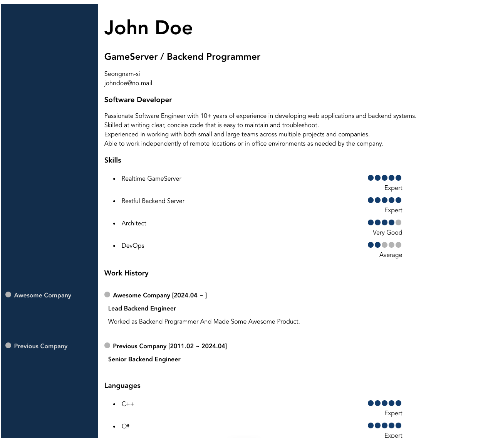

# Resumii

Generate Your Resume For Free
Put your information to be shown in resume step by step, get generated resume.

We don't save your information in server, but you can load/save your local saved resume information from a file already written by RESUMII.

> [!Note]
> Try Here  
> [https://resumiii.vercel.app]()

## For Free

Resumii is provided for free.

## No Signup

No need to signup, login. We don't save your information.

## Blazing Easy

Follow just few steps to make it.

## Reliable

Resumii code is maintained as open source. You can read / contribute the code,  
and you can see that it doesn't save your information.

## example

